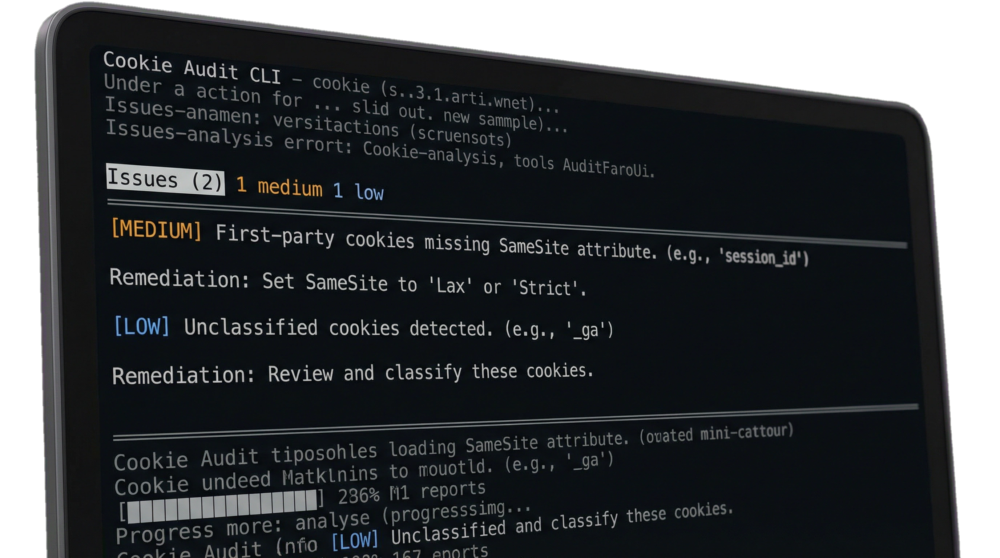
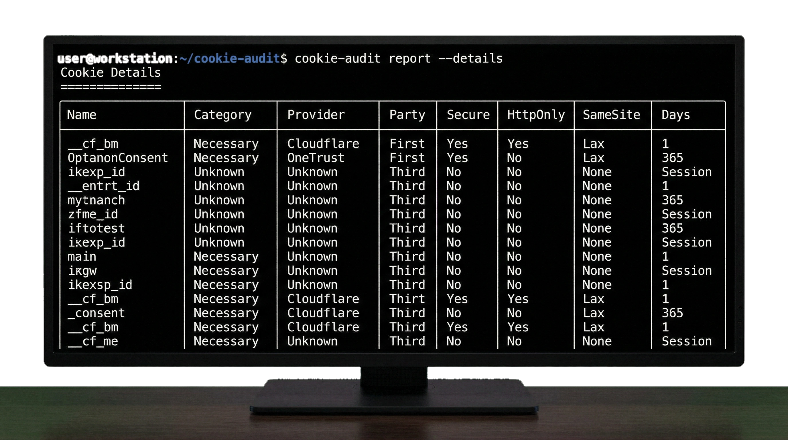
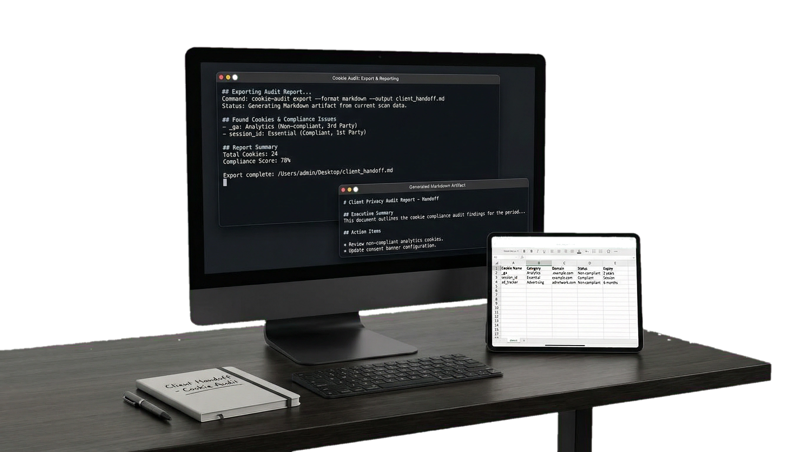

# cookie-audit: scan any website for cookies and GDPR/ePrivacy compliance issues.

<p align="center">
  
</p>

cookie-audit opens a site in headless Chromium, captures every cookie (first-party, third-party, JavaScript-set), classifies them against a built-in database of 470+ known cookies, and checks for compliance violations. The output is a graded report with actionable remediation steps.

Built by [diShine](https://dishine.it). MIT Licensed.

<p align="center">
  
  
</p>

---

## How it works

1. Opens the URL in headless Chromium (via Puppeteer)
2. Captures every cookie set during page load
3. Classifies each cookie as **necessary**, **functional**, **analytics**, **marketing**, or **unknown** using a 470+ entry database
4. Runs 10 compliance checks (consent-before-tracking, Secure/HttpOnly flags, SameSite policy, excessive lifetimes, third-party exposure, and more)
5. Outputs a graded report (terminal, JSON, CSV, or Markdown)

Optionally, it can click the consent banner and re-scan to compare cookies set before and after consent.

---

## Quick start

```bash
# Install globally
npm install -g @dishine/cookie-audit

# Scan a website
cookie-audit example.com

# Save a Markdown report
cookie-audit example.com -f markdown -o report.md

# Scan with consent interaction
cookie-audit example.com -c

# Batch scan from a file
cookie-audit urls.txt -f csv -o audit.csv
```

Or run directly without installing:

```bash
npx @dishine/cookie-audit example.com
```

---

## Output

### Terminal (default)

```
  Cookie Audit Report
  https://example.com — 4 Apr 2026, 14:30
  ────────────────────────────────────────────────────────────

  Compliance:  C   WARN

  Summary
  Total cookies: 14  (8 first-party, 6 third-party)

  necessary    ██████░░░░░░░░░░░░░░  3 (21%)
  functional   ██░░░░░░░░░░░░░░░░░░  1 (7%)
  analytics    ████████░░░░░░░░░░░░  4 (29%)
  marketing    ██████████░░░░░░░░░░  5 (36%)
  unknown      ██░░░░░░░░░░░░░░░░░░  1 (7%)

  Consent: Detected (cookiebot)

  Issues (3)  1 critical 1 high 1 medium

   CRITICAL   Non-essential cookies set before user consent
              5 cookies (analytics/marketing) detected on initial page load...
              Fix: Configure your tag manager to fire tags only after consent.

  Cookie Details
  Name                         Category     Provider               Party Secure HttpOnly SameSite Days
  ──────────────────────────────────────────────────────────────────────────────────────────────────
  __cf_bm                      necessary    Cloudflare             1st   Y      Y        Lax      1
  _ga                          analytics    Google Analytics       1st   Y      N        Lax      730
  _fbp                         marketing    Meta (Facebook)        1st   Y      N        Lax      90
  ...
```

### Other formats

| Format | Flag | Use case |
|--------|------|----------|
| `table` | `-f table` (default) | Terminal review |
| `json` | `-f json` | Dashboards, scripts, CI/CD pipelines |
| `csv` | `-f csv` | Spreadsheets, client handoff |
| `markdown` | `-f markdown` | Reports, documentation, tickets |
| `html` | `-f html` | Self-contained report for browsers, stakeholders |

---

## Options

| Flag | Description | Default |
|------|-------------|---------|
| `-f, --format` | Output format: `table`, `json`, `csv`, `markdown`, `html` | `table` |
| `-o, --output` | Save report to file | stdout |
| `-w, --wait` | Wait time (ms) for page load | `5000` |
| `-t, --timeout` | Navigation timeout (ms) per page | `30000` |
| `--user-agent` | Custom User-Agent string | Chromium default |
| `-c, --consent` | Click consent banner, then re-scan | off |
| `--no-headless` | Show the browser window (debugging) | headless |
| `-q, --quiet` | Suppress progress messages | off |

---

## Compliance checks

| Check | Severity | What it flags |
|-------|----------|---------------|
| Non-essential cookies before consent | critical | Analytics/marketing cookies on page load without consent |
| No consent mechanism | critical | Tracking cookies present but no CMP banner |
| Missing Secure flag | high | Cookies transmittable over HTTP |
| Session cookies without HttpOnly | high | Auth cookies accessible via JavaScript (XSS risk) |
| SameSite=None without Secure | high | Cookies rejected by modern browsers |
| Excessive lifetime (>13 months) | medium | Exceeds CNIL/DPA guidelines |
| Third-party cookies | medium | Cross-site tracking exposure |
| Missing SameSite attribute | medium | CSRF vulnerability |
| Unclassified cookies | low | Need manual review |
| Overly broad domain scope | low | Shared across all subdomains |

## Cookie database

The built-in database covers 470+ cookies and domains from:

- **Google** — Analytics, Ads, Tag Manager, reCAPTCHA, Optimize
- **Meta** — Facebook Pixel, Instagram
- **LinkedIn**, **Microsoft** (Bing Ads, Clarity), **TikTok**, **Twitter/X**, **Pinterest**, **Snapchat**, **Reddit**, **Quora**
- **Adobe** — Analytics, Target, Audience Manager, Experience Cloud
- **Salesforce** / Pardot, **Marketo**, **HubSpot**
- **Analytics** — Hotjar, Mixpanel, Segment, Amplitude, Heap, PostHog, Pendo, FullStory, Mouseflow, Snowplow, Lucky Orange, ContentSquare, Matomo, Plausible, Fathom, Umami
- **A/B testing** — Optimizely, VWO, AB Tasty, Kameleoon, Unbounce
- **E-commerce** — Shopify, WooCommerce, Magento, Stripe, PayPal, Klarna
- **Consent platforms** — Cookiebot, OneTrust, CookieYes, Complianz, Didomi, Usercentrics, iubenda, Tarteaucitron, Klaro, Borlabs Cookie, IAB TCF
- **Chat/Support** — Intercom, Drift, Zendesk, LiveChat, Tawk.to, Crisp, Freshworks
- **Infrastructure** — Cloudflare, Akamai, Fastly, Imperva, Sucuri
- **Auth** — Auth0, Okta, NextAuth.js, Supabase, Vercel, Netlify
- **Monitoring** — Sentry, New Relic, Datadog, Rollbar, Bugsnag, LogRocket
- **Advertising** — Criteo, Taboola, Outbrain, AdRoll, TradeDoubler, Amazon Ads
- **Asian platforms** — Baidu, Yandex Metrica

Cookies not in the database are classified by heuristic (name patterns, domain, lifetime).

### Consent detection

Automatically detects: Cookiebot, OneTrust, CookieYes, Complianz, Quantcast, Didomi, Axeptio, Termly, IAB TCF, and generic cookie banners.

---

## Batch scanning

```
# urls.txt
https://example.com
https://shop.example.com
https://blog.example.com
```

```bash
cookie-audit urls.txt -f csv -o audit.csv
```

---

## Programmatic API

```javascript
import { scan, classify, analyze, formatMarkdown } from "@dishine/cookie-audit";

const result = await scan("https://example.com", { waitMs: 5000 });
const classified = classify(result.cookiesBeforeConsent);
const report = analyze(result, classified);

console.log(formatMarkdown(report));

// Access structured data
console.log(report.summary.complianceScore); // "B"
console.log(report.issues);                  // Array of issues with remediation
console.log(report.cookies);                 // Array of classified cookies
```

---

## Exit codes

| Code | Meaning |
|------|---------|
| `0` | No critical issues |
| `1` | Critical compliance issues detected |
| `2` | Fatal error (scan failed) |

Useful in CI/CD: `cookie-audit example.com || echo "Compliance check failed"`.

---

## Requirements

- **Node.js** 18 or later
- Chromium is downloaded automatically by Puppeteer on first install (~300 MB)

---

## Contributing

See [CONTRIBUTING.md](CONTRIBUTING.md) for guidelines.

## Security

See [SECURITY.md](SECURITY.md) for reporting vulnerabilities.

## License

MIT — see [LICENSE](LICENSE) for details.

Copyright (c) 2026 [diShine](https://dishine.it)
